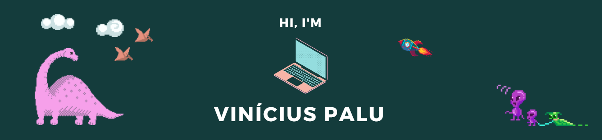

<samp>

  Hey there! My name is Vinicius Palu. I am a graduate game developer who has worked with Delphi for 5 years and is now open to new jobs. I've also been focusing on studying  other technologies, mainly Flutter and Python. 
  You can reach me out any way you see fit through the badges above! 
</samp>

 

## 💼 Skills

<!---->

C, C++, C#, Python, Flutter; Git, Bitbucket, Trello; Photoshop;

 

## &#x1f4c8; GitHub Stats

 
 

## Take a look at my repos! ⬇️
